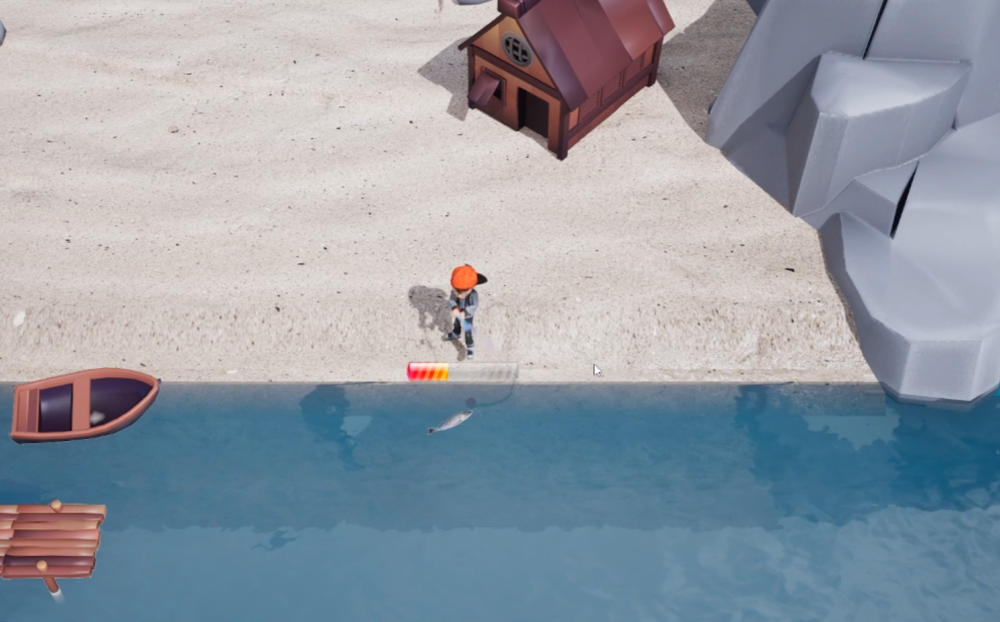
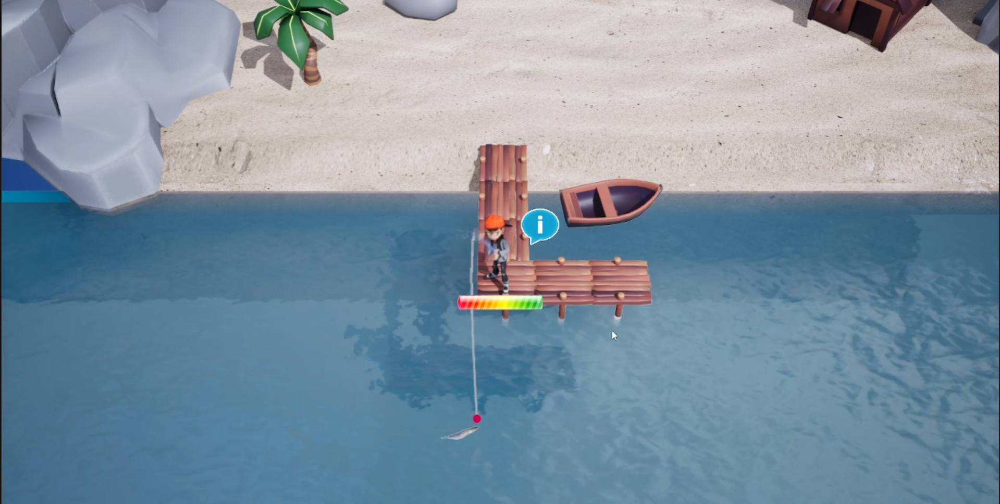
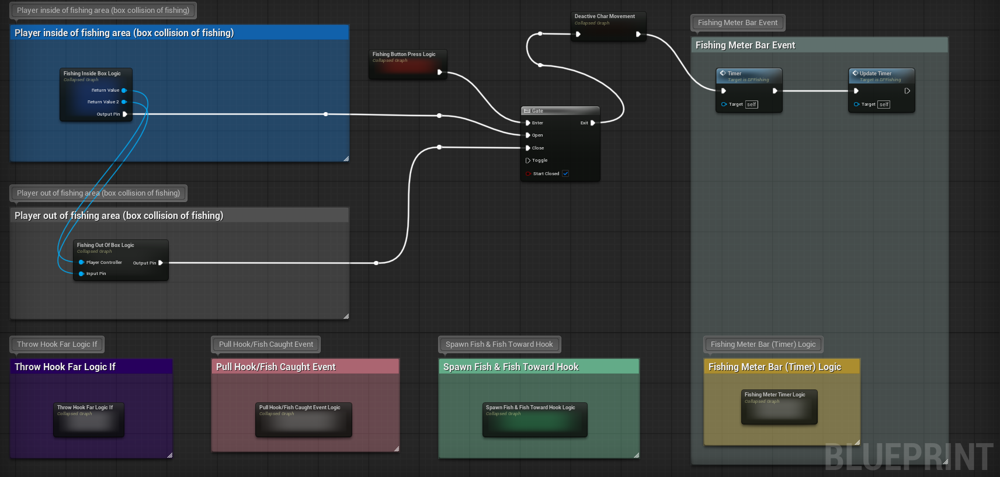
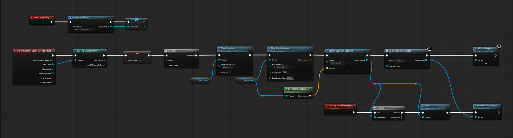
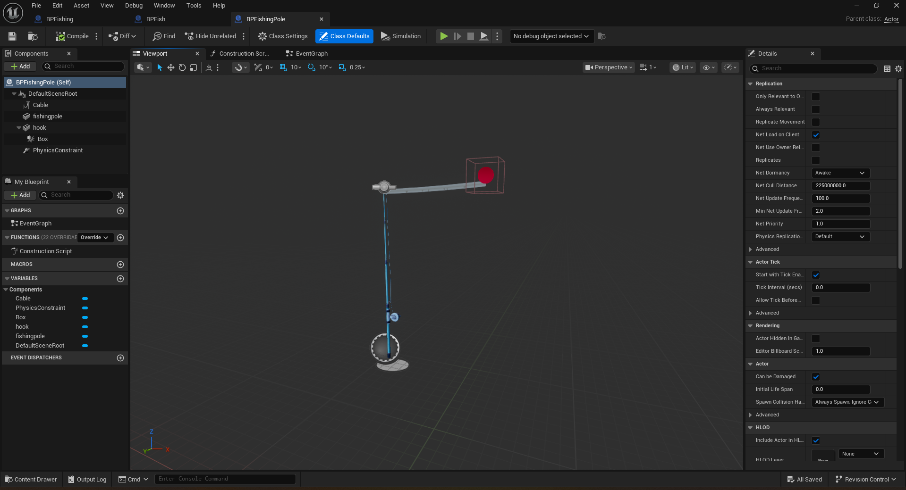

# Unreal Engine Blueprint Fishing System Prototype

Engine Version: Unreal Engine 5.0.2  

## Overview
This prototype demonstrates a modular fishing mechanic built entirely using Blueprint.  
The system focuses on clean logic grouping and event-driven gameplay flow.

---

## Key Features

- Hook casting with adjustable power meter
- Fishing zone detection (box trigger logic)
- Fish spawn & movement toward hook
- Fishing progress interaction system
- Sound effect integration
- Flexible fishing line behavior
- Modular blueprint logic grouping

---

## Preview

### Gameplay

### Blueprint Structure

---

## Gameplay Video

https://youtu.be/onwFaP9--1o

---

## Technical Focus

- Blueprint-based modular system design
- Clear logical separation using grouped nodes
- Event-driven gameplay flow
- Structured mechanic implementation
