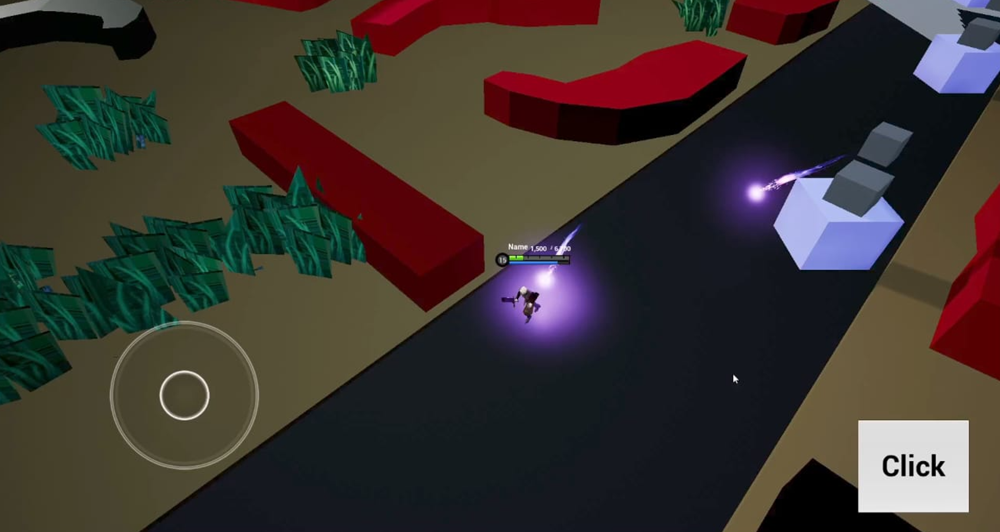
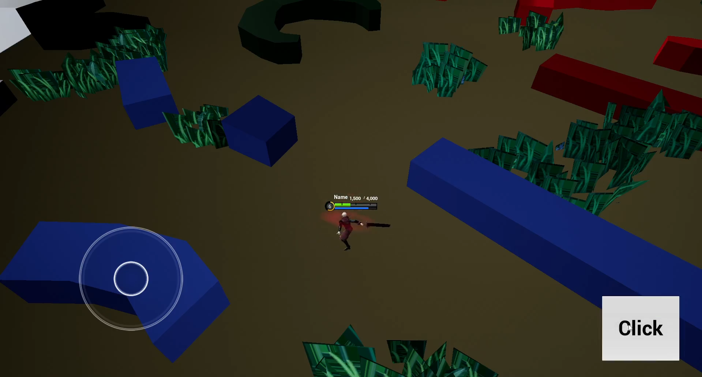

# Unreal Engine C++ MOBA Combat Prototype

Engine Version: Unreal Engine 4.27.2  

## Overview
This prototype demonstrates gameplay combat implementation using C++ in Unreal Engine.  
The focus is on modular gameplay logic and basic combat mechanics rather than visual polish.

---

## Key Features

- Character movement and combat logic
- Basic attack system
- Turret projectile tracking logic
- Health bar UI representation
- Public / Private class structure separation
- Object-oriented gameplay architecture

---

## Preview

### Gameplay

---

## Gameplay Video

https://youtu.be/_oCFz3EY4X4

---

## Technical Focus

- C++ gameplay programming
- Modular system structure
- Basic combat and projectile implementation
